# Patient Lookup - CarePlus

CarePlus is a full-stack patient lookup and management application built with Spring Boot, PostgreSQL, and React.

The application provides secure patient search and management using JWT authentication and role-based access control.

## Features

* JWT-based authentication
* Role-based access control
* Patient search by first or last name
* Server-side pagination
* View patient details
* Create patient records
* Update patient records
* Delete patient records
* Duplicate email validation
* Employee self-registration
* Administrator user access management
* Administrators cannot change their own access level
* Swagger / OpenAPI documentation
* Centralized exception handling
* Application logging
* Light and dark theme support
* Backend unit and controller tests

## Technology Stack

### Backend

* Java 17
* Spring Boot
* Spring Data JPA
* Spring Security
* JWT
* PostgreSQL
* Maven
* Lombok
* Swagger / OpenAPI
* JUnit 5
* Mockito

### Frontend

* React
* Vite
* Axios
* Bootstrap
* JavaScript

## Test Accounts

The following accounts are available for demonstration and testing.

### Administrator

```text
Username: admin
Password: admin123
```

### Employee

```text
Username: employee
Password: employee123
```

## Role-Based Access

| Feature                | Administrator | Employee |
| ---------------------- | ------------- | -------- |
| View patients          | Yes           | Yes      |
| Search patients        | Yes           | Yes      |
| View patient details   | Yes           | Yes      |
| Create patients        | Yes           | No       |
| Update patients        | Yes           | No       |
| Delete patients        | Yes           | No       |
| View application users | Yes           | No       |
| Change user roles      | Yes           | No       |

Administrators cannot change their own access level.

Public signup always creates a user with the `EMPLOYEE` role.

## Prerequisites

Install the following before running the application:

* Java 17
* Maven
* Node.js
* npm
* PostgreSQL
* Docker Desktop, if using the provided Docker setup for PostgreSQL

## Database Setup

The application uses PostgreSQL.

A Docker Compose configuration is included at the project root:

```text
docker-compose.yml
```

If Docker is used, start the PostgreSQL container from the project root with:

```bash
docker compose up -d
```

The application is configured to use:

```text
Host: localhost
Port: 5432
Database: patientdb
```

The database scripts used by Spring Boot are located at:

```text
backend/src/main/resources/schema.sql
backend/src/main/resources/data.sql
```

`schema.sql` creates the required tables and indexes.

`data.sql` contains the initial patient seed data.

Application users such as the test administrator and employee accounts are initialized by the backend when required.

## Running the Backend

Navigate to the backend directory:

```bash
cd backend
```

Run the Spring Boot application:

```bash
./mvnw spring-boot:run
```

On Windows:

```bash
mvnw.cmd spring-boot:run
```

If Maven is installed globally, you can also run:

```bash
mvn spring-boot:run
```

The backend will be available at:

```text
http://localhost:8080
```

## Running the Frontend

Navigate to the frontend directory:

```bash
cd frontend
```

Install frontend dependencies:

```bash
npm install
```

Start the Vite development server:

```bash
npm run dev
```

The frontend will be available at:

```text
http://localhost:5173
```

## Frontend Environment Configuration

An example environment file is provided at:

```text
frontend/.env.example
```

It contains:

```env
VITE_API_URL=http://localhost:8080/api
```

The frontend also defaults to:

```text
http://localhost:8080/api
```

when `VITE_API_URL` is not configured.

If a custom configuration is required, copy:

```text
frontend/.env.example
```

to:

```text
frontend/.env
```

and update the API URL.

## Swagger / OpenAPI

Swagger UI is available at:

```text
http://localhost:8080/swagger-ui.html
```

The OpenAPI specification is also available in the repository at:

```text
docs/openapi.yaml
```

Protected endpoints require JWT authentication.

To test protected endpoints:

1. Call `POST /api/auth/login` using one of the test accounts.
2. Copy the returned JWT token.
3. Click **Authorize** in Swagger UI.
4. Enter the JWT token.
5. Test the secured endpoints.

## API Endpoints

### Authentication

```text
POST /api/auth/login
POST /api/auth/signup
```

### Patients

```text
GET    /api/patients
GET    /api/patients/{id}
POST   /api/patients
PUT    /api/patients/{id}
DELETE /api/patients/{id}
```

The patient list endpoint supports pagination and optional name search.

Example:

```text
GET /api/patients?name=Smith&page=0&size=5
```

Sorting is also supported.

Example:

```text
GET /api/patients?page=0&size=5&sort=patientId,asc
```

### User Administration

```text
GET /api/users
PUT /api/users/{id}/role
```

These endpoints are restricted to users with the `ADMIN` role.

## Patient Search and Pagination

The patient list uses server-side pagination.

The default page size is:

```text
5
```

The application displays the total number of matching patient records at the top of the page.

Pagination controls allow navigation between result pages.

Patient name search works together with pagination.

## Validation and Error Handling

The application uses centralized exception handling for common API errors.

Handled scenarios include:

* Patient not found
* User not found
* Invalid request data
* Duplicate patient email
* Duplicate username during signup
* Unauthorized access
* Forbidden operations
* Unexpected server errors

Duplicate patient emails return a meaningful conflict response instead of a generic server error.

## Security

The application uses Spring Security and JWT authentication.

Passwords are encoded before being stored.

Protected endpoints require a valid JWT token.

### Administrator

Administrators can:

* View and search patients
* View patient details
* Create patients
* Update patients
* Delete patients
* View application users
* Change other users' roles

Administrators cannot change their own access level.

### Employee

Employees can:

* View patients
* Search patients
* View patient details

Employees cannot create, update, or delete patient records.

## Logging

The backend uses SLF4J logging.

Logging is included for:

* Patient API requests
* Patient service operations
* Authentication activity
* User access management
* Validation failures
* Not-found exceptions
* Unexpected application errors

Sensitive information such as passwords and JWT token values is not written to application logs.

## Testing

The backend includes unit and controller tests using JUnit 5, Mockito, MockMvc, and Spring Security test support.

The test suite includes coverage for:

* Patient creation
* Patient lookup
* Patient update
* Patient deletion
* Duplicate patient email handling
* Patient not-found behavior
* Role-based patient endpoint security
* Controller validation and HTTP responses
* Employee signup
* Duplicate username handling
* Password encoding during signup
* Administrator user access management
* Administrator self-role-change protection
* Invalid role updates
* Missing application users

Run the test suite with:

```bash
cd backend
mvn test
```

Run the full Maven build with tests:

```bash
mvn clean install
```

A successful build should complete with:

```text
BUILD SUCCESS
```

## Project Structure

```text
patient-lookup-system/
├── backend/
│   ├── src/
│   │   ├── main/
│   │   │   ├── java/
│   │   │   └── resources/
│   │   │       ├── schema.sql
│   │   │       └── data.sql
│   │   │
│   │   └── test/
│   │       └── java/
│   │           └── com/patientlookup/app/
│   │
│   └── pom.xml
│
├── docs/
│   ├── openapi.yaml
│   └── screenshots/
│
├── frontend/
│   ├── src/
│   ├── .env.example
│   ├── package.json
│   └── package-lock.json
│
├── docker-compose.yml
└── README.md
```

## Additional Features

In addition to the core patient CRUD requirements, the project includes:

* JWT authentication
* Role-based authorization
* Employee signup
* Administrator user management
* Administrator self-role-change protection
* Server-side pagination
* Live patient search
* Duplicate email protection
* Swagger JWT authentication support
* Centralized exception handling
* Application logging
* Responsive user interface
* Persistent light and dark themes
* Automated backend tests

## Application URLs

### Frontend

```text
http://localhost:5173
```

### Backend

```text
http://localhost:8080
```

### Swagger UI

```text
http://localhost:8080/swagger-ui.html
```

## Notes

This project demonstrates:

* REST API development with Spring Boot
* PostgreSQL database integration
* Spring Data JPA
* JWT authentication
* Role-based authorization
* React frontend development
* API documentation with Swagger / OpenAPI
* Validation and exception handling
* Pagination and search
* Application logging
* Automated backend testing
* Frontend theme management

## Screenshots

The screenshots below provide a visual walkthrough of the main application functionality for administrator and employee users.

### 1. Sign Up

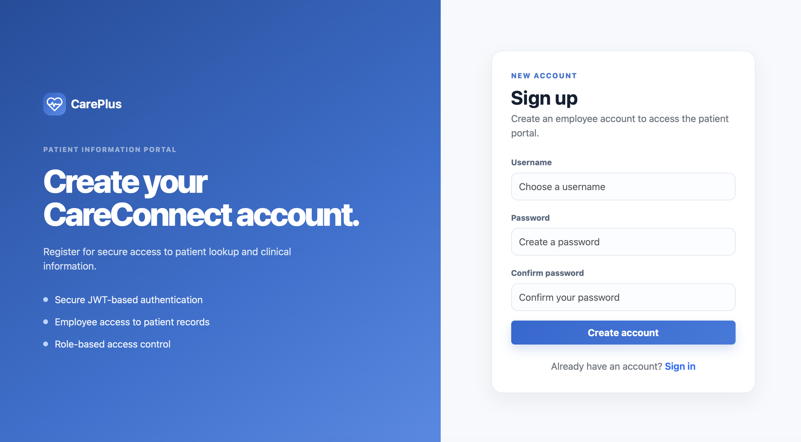

### 2. Sign In

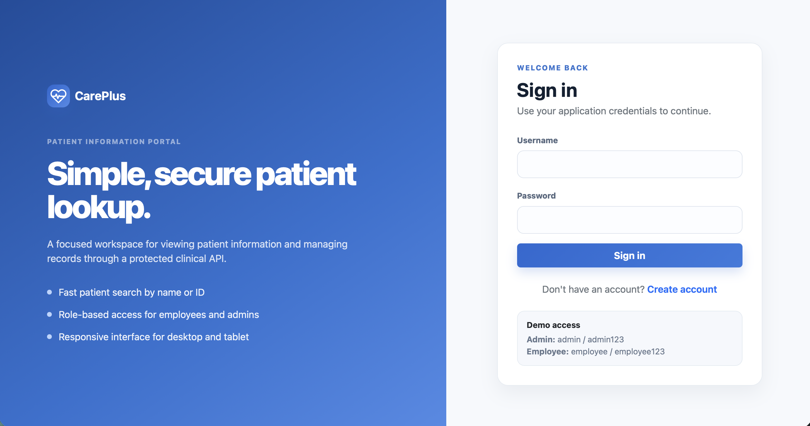

### 3. Administrator Patient List

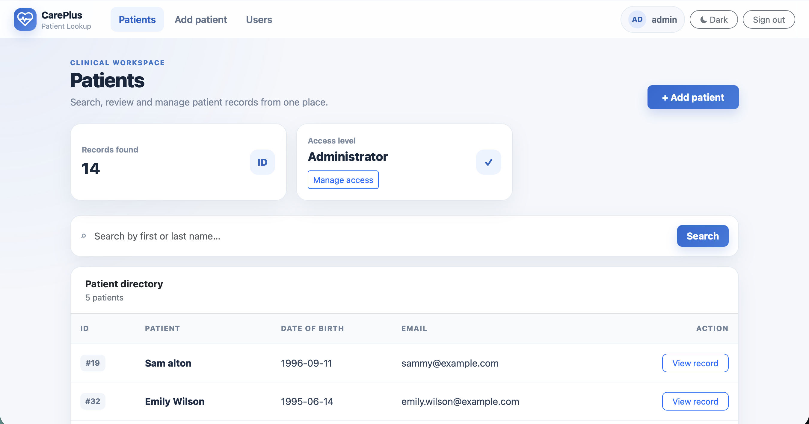

### 4. Administrator Patient List - Additional View

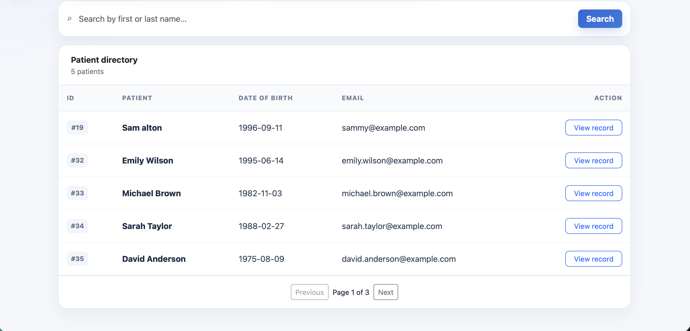

### 5. Administrator Patient Details

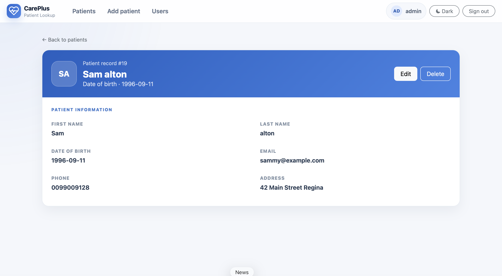

### 6. Administrator Edit Patient

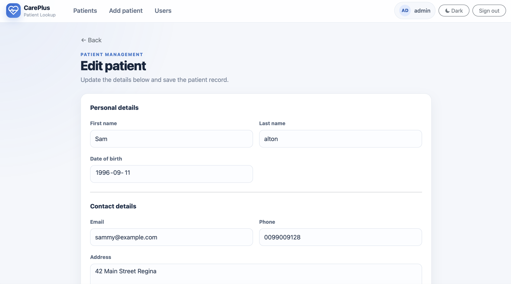

### 7. Administrator Delete Patient

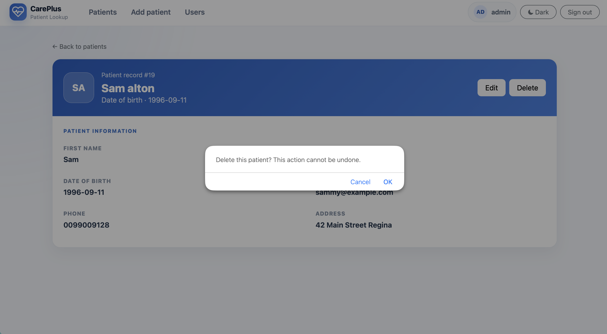

### 8. Add New Patient

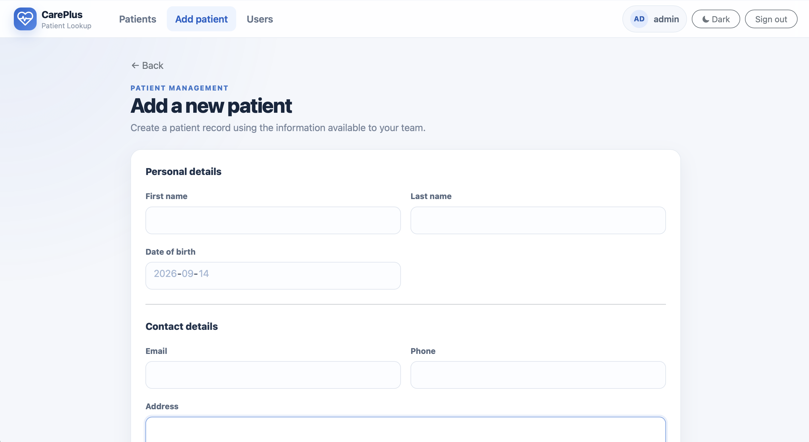

### 9. Add New Patient - Additional View

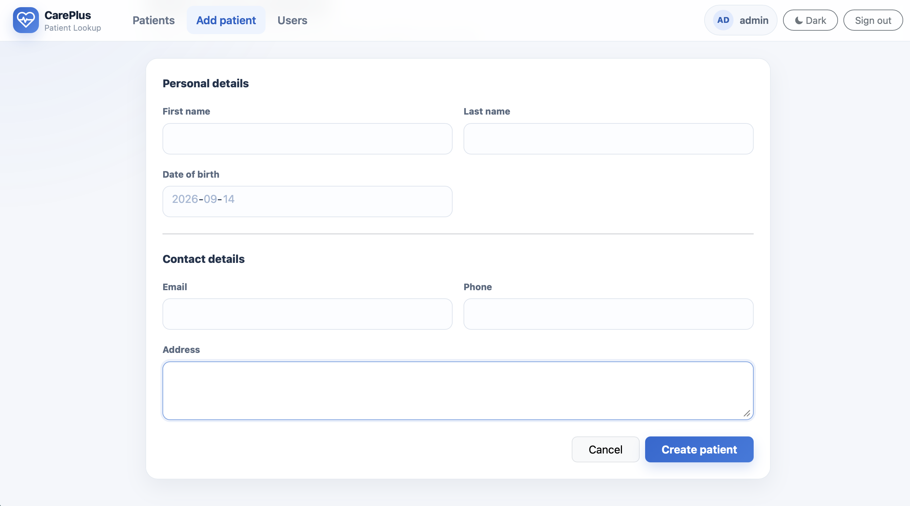

### 10. Employee Login View

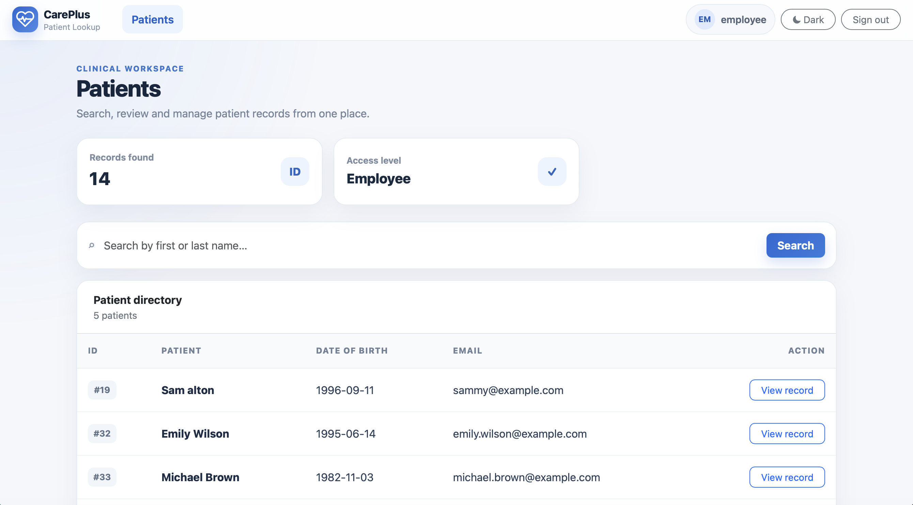

### 11. Employee Patient List

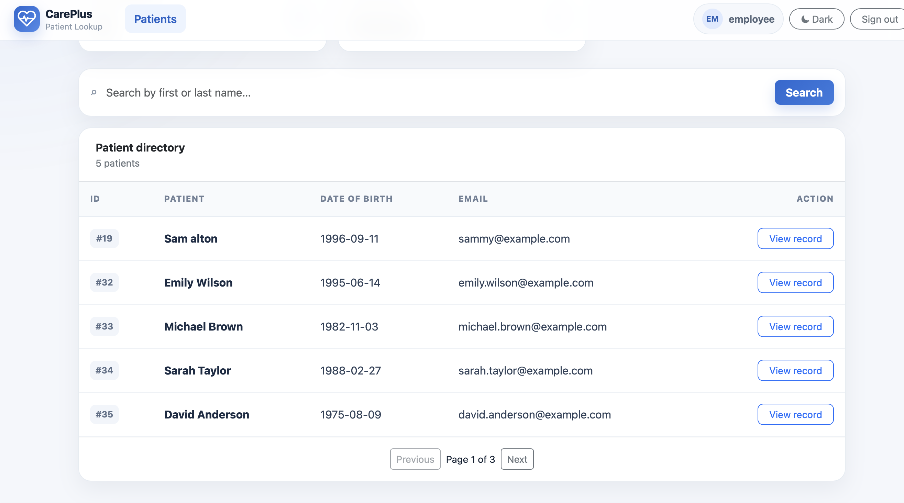

### 12. Employee Patient Details

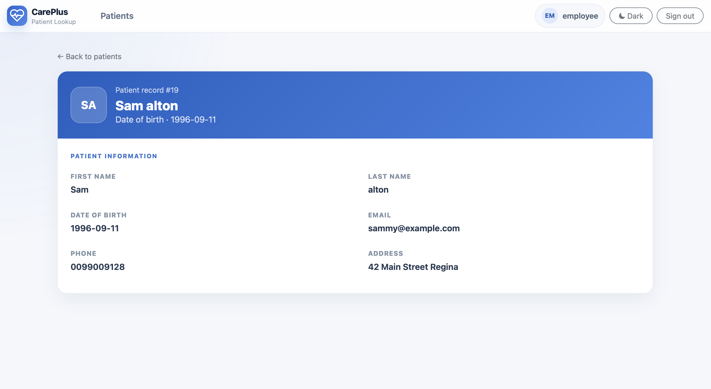

### 13. Dynamic Patient Search

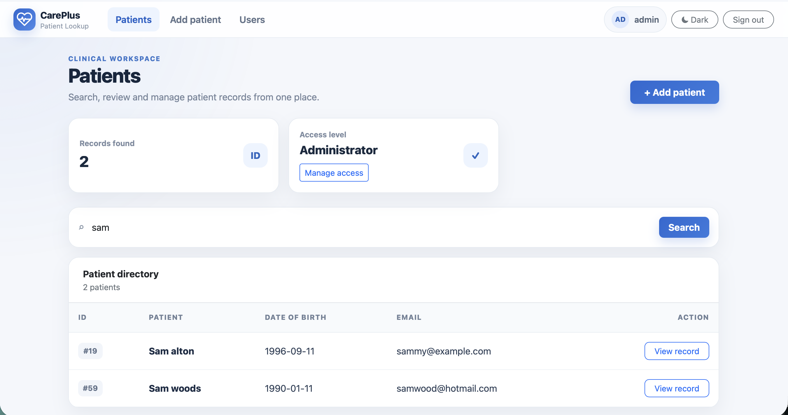

### 14. Administrator User Access Management

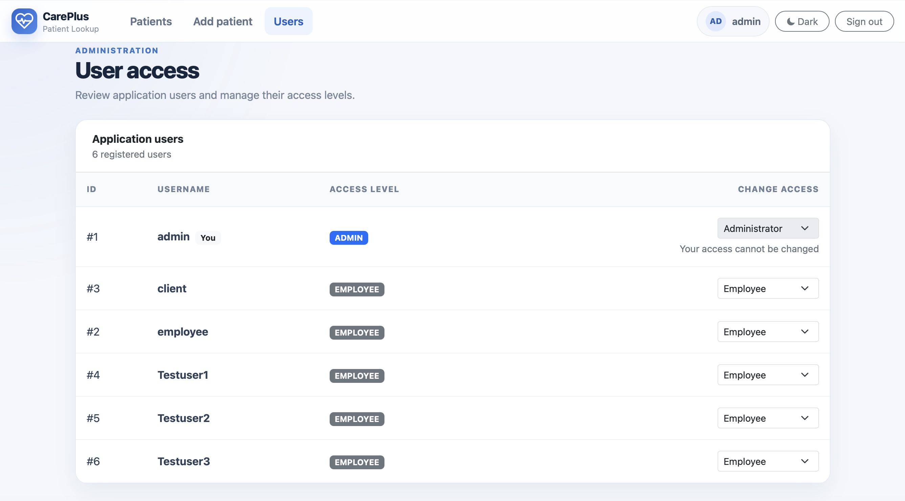

### 15. Dark Theme

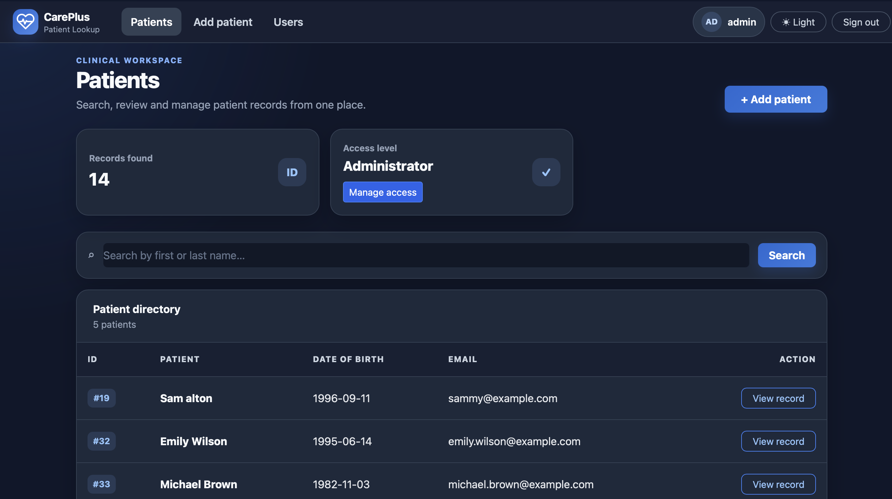

### 16. Swagger UI

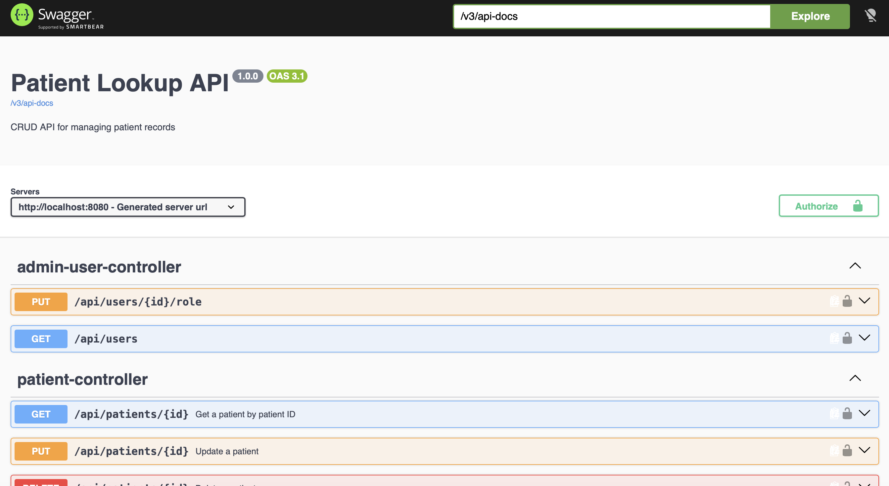

### 17. Swagger API View

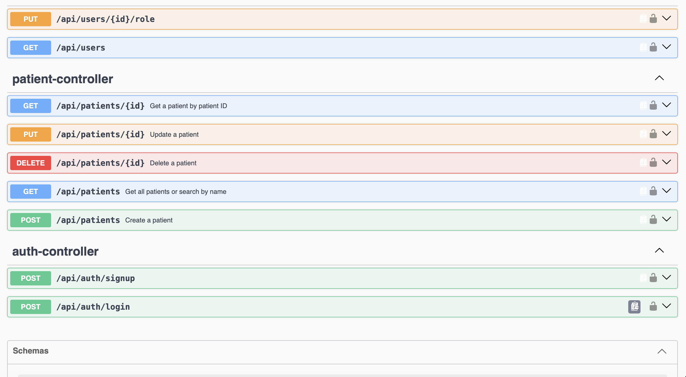
